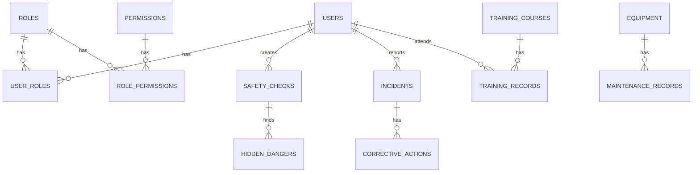

# 数据库设计文档

## 概述

本系统使用SQLite数据库，采用轻量级关系型数据库设计，满足铁路安全监控系统的数据存储需求。

## 数据库结构

### 实体关系图（ER图）



## 数据表设计

### 1. 用户管理模块

#### 用户表 (users)
```sql
CREATE TABLE users (
    id INTEGER PRIMARY KEY AUTOINCREMENT,
    username VARCHAR(50) UNIQUE NOT NULL,
    password_hash VARCHAR(255) NOT NULL,
    full_name VARCHAR(100) NOT NULL,
    email VARCHAR(100) UNIQUE,
    phone VARCHAR(20),
    department VARCHAR(50),
    position VARCHAR(50),
    status INTEGER DEFAULT 1, -- 1:启用, 0:禁用
    created_at DATETIME DEFAULT CURRENT_TIMESTAMP,
    updated_at DATETIME DEFAULT CURRENT_TIMESTAMP
);
```

#### 角色表 (roles)
```sql
CREATE TABLE roles (
    id INTEGER PRIMARY KEY AUTOINCREMENT,
    role_name VARCHAR(50) UNIQUE NOT NULL,
    role_code VARCHAR(30) UNIQUE NOT NULL,
    description TEXT,
    created_at DATETIME DEFAULT CURRENT_TIMESTAMP
);
```

#### 用户角色关联表 (user_roles)
```sql
CREATE TABLE user_roles (
    id INTEGER PRIMARY KEY AUTOINCREMENT,
    user_id INTEGER NOT NULL,
    role_id INTEGER NOT NULL,
    created_at DATETIME DEFAULT CURRENT_TIMESTAMP,
    FOREIGN KEY (user_id) REFERENCES users(id),
    FOREIGN KEY (role_id) REFERENCES roles(id),
    UNIQUE(user_id, role_id)
);
```

#### 权限表 (permissions)
```sql
CREATE TABLE permissions (
    id INTEGER PRIMARY KEY AUTOINCREMENT,
    permission_name VARCHAR(50) NOT NULL,
    permission_code VARCHAR(50) NOT NULL,
    resource VARCHAR(50) NOT NULL,
    action VARCHAR(50) NOT NULL,
    description TEXT,
    created_at DATETIME DEFAULT CURRENT_TIMESTAMP
);
```

#### 角色权限关联表 (role_permissions)
```sql
CREATE TABLE role_permissions (
    id INTEGER PRIMARY KEY AUTOINCREMENT,
    role_id INTEGER NOT NULL,
    permission_id INTEGER NOT NULL,
    created_at DATETIME DEFAULT CURRENT_TIMESTAMP,
    FOREIGN KEY (role_id) REFERENCES roles(id),
    FOREIGN KEY (permission_id) REFERENCES permissions(id),
    UNIQUE(role_id, permission_id)
);
```

### 2. 安全管理模块

#### 安全检查表 (safety_checks)
```sql
CREATE TABLE safety_checks (
    id INTEGER PRIMARY KEY AUTOINCREMENT,
    check_no VARCHAR(50) UNIQUE NOT NULL,
    check_type VARCHAR(30) NOT NULL, -- daily, weekly, monthly, special
    check_title VARCHAR(200) NOT NULL,
    check_content TEXT,
    location VARCHAR(100),
    check_date DATE NOT NULL,
    checker_id INTEGER NOT NULL,
    status VARCHAR(20) DEFAULT 'pending', -- pending, completed, cancelled
    result VARCHAR(20), -- pass, fail, partial
    score INTEGER,
    remarks TEXT,
    created_at DATETIME DEFAULT CURRENT_TIMESTAMP,
    updated_at DATETIME DEFAULT CURRENT_TIMESTAMP,
    FOREIGN KEY (checker_id) REFERENCES users(id)
);
```

#### 隐患表 (hidden_dangers)
```sql
CREATE TABLE hidden_dangers (
    id INTEGER PRIMARY KEY AUTOINCREMENT,
    danger_no VARCHAR(50) UNIQUE NOT NULL,
    check_id INTEGER,
    danger_title VARCHAR(200) NOT NULL,
    danger_level VARCHAR(20) NOT NULL, -- low, medium, high, critical
    danger_type VARCHAR(50),
    location VARCHAR(100),
    description TEXT,
    discovery_date DATE,
    discoverer_id INTEGER,
    responsible_id INTEGER,
    deadline DATE,
    status VARCHAR(20) DEFAULT 'open', -- open, in_progress, closed
    corrective_action TEXT,
    completion_date DATE,
    verification_result VARCHAR(20),
    verifier_id INTEGER,
    created_at DATETIME DEFAULT CURRENT_TIMESTAMP,
    updated_at DATETIME DEFAULT CURRENT_TIMESTAMP,
    FOREIGN KEY (check_id) REFERENCES safety_checks(id),
    FOREIGN KEY (discoverer_id) REFERENCES users(id),
    FOREIGN KEY (responsible_id) REFERENCES users(id),
    FOREIGN KEY (verifier_id) REFERENCES users(id)
);
```

#### 事故表 (incidents)
```sql
CREATE TABLE incidents (
    id INTEGER PRIMARY KEY AUTOINCREMENT,
    incident_no VARCHAR(50) UNIQUE NOT NULL,
    incident_type VARCHAR(50) NOT NULL,
    incident_level VARCHAR(20) NOT NULL, -- minor, moderate, major, catastrophic
    incident_title VARCHAR(200) NOT NULL,
    incident_time DATETIME NOT NULL,
    location VARCHAR(200),
    description TEXT,
    cause_analysis TEXT,
    damage_assessment TEXT,
    reporter_id INTEGER NOT NULL,
    status VARCHAR(20) DEFAULT 'reported', -- reported, investigating, closed
    created_at DATETIME DEFAULT CURRENT_TIMESTAMP,
    updated_at DATETIME DEFAULT CURRENT_TIMESTAMP,
    FOREIGN KEY (reporter_id) REFERENCES users(id)
);
```

#### 整改措施表 (corrective_actions)
```sql
CREATE TABLE corrective_actions (
    id INTEGER PRIMARY KEY AUTOINCREMENT,
    action_no VARCHAR(50) UNIQUE NOT NULL,
    incident_id INTEGER NOT NULL,
    action_title VARCHAR(200) NOT NULL,
    action_content TEXT,
    responsible_id INTEGER,
    deadline DATE,
    status VARCHAR(20) DEFAULT 'pending', -- pending, in_progress, completed
    completion_date DATE,
    verification_result VARCHAR(20),
    verifier_id INTEGER,
    created_at DATETIME DEFAULT CURRENT_TIMESTAMP,
    updated_at DATETIME DEFAULT CURRENT_TIMESTAMP,
    FOREIGN KEY (incident_id) REFERENCES incidents(id),
    FOREIGN KEY (responsible_id) REFERENCES users(id),
    FOREIGN KEY (verifier_id) REFERENCES users(id)
);
```

### 3. 培训管理模块

#### 培训课程表 (training_courses)
```sql
CREATE TABLE training_courses (
    id INTEGER PRIMARY KEY AUTOINCREMENT,
    course_code VARCHAR(50) UNIQUE NOT NULL,
    course_name VARCHAR(200) NOT NULL,
    course_type VARCHAR(50), -- safety, skill, regulation
    description TEXT,
    duration_hours INTEGER,
    instructor VARCHAR(100),
    course_content TEXT,
    passing_score INTEGER DEFAULT 80,
    status VARCHAR(20) DEFAULT 'active', -- active, inactive
    created_at DATETIME DEFAULT CURRENT_TIMESTAMP,
    updated_at DATETIME DEFAULT CURRENT_TIMESTAMP
);
```

#### 培训记录表 (training_records)
```sql
CREATE TABLE training_records (
    id INTEGER PRIMARY KEY AUTOINCREMENT,
    record_no VARCHAR(50) UNIQUE NOT NULL,
    course_id INTEGER NOT NULL,
    user_id INTEGER NOT NULL,
    training_date DATE,
    completion_date DATE,
    score INTEGER,
    result VARCHAR(20), -- pass, fail
    certificate_no VARCHAR(50),
    certificate_expiry DATE,
    status VARCHAR(20) DEFAULT 'enrolled', -- enrolled, completed, expired
    created_at DATETIME DEFAULT CURRENT_TIMESTAMP,
    updated_at DATETIME DEFAULT CURRENT_TIMESTAMP,
    FOREIGN KEY (course_id) REFERENCES training_courses(id),
    FOREIGN KEY (user_id) REFERENCES users(id)
);
```

### 4. 设备管理模块

#### 设备表 (equipment)
```sql
CREATE TABLE equipment (
    id INTEGER PRIMARY KEY AUTOINCREMENT,
    equipment_code VARCHAR(50) UNIQUE NOT NULL,
    equipment_name VARCHAR(200) NOT NULL,
    equipment_type VARCHAR(50),
    model VARCHAR(100),
    manufacturer VARCHAR(100),
    purchase_date DATE,
    installation_date DATE,
    location VARCHAR(200),
    responsible_id INTEGER,
    status VARCHAR(20) DEFAULT 'normal', -- normal, maintenance, retired
    warranty_expiry DATE,
    next_maintenance_date DATE,
    created_at DATETIME DEFAULT CURRENT_TIMESTAMP,
    updated_at DATETIME DEFAULT CURRENT_TIMESTAMP,
    FOREIGN KEY (responsible_id) REFERENCES users(id)
);
```

#### 维护记录表 (maintenance_records)
```sql
CREATE TABLE maintenance_records (
    id INTEGER PRIMARY KEY AUTOINCREMENT,
    record_no VARCHAR(50) UNIQUE NOT NULL,
    equipment_id INTEGER NOT NULL,
    maintenance_type VARCHAR(50), -- routine, repair, overhaul
    maintenance_date DATE,
    maintenance_content TEXT,
    maintainer_id INTEGER,
    cost DECIMAL(10,2),
    next_maintenance_date DATE,
    remarks TEXT,
    created_at DATETIME DEFAULT CURRENT_TIMESTAMP,
    FOREIGN KEY (equipment_id) REFERENCES equipment(id),
    FOREIGN KEY (maintainer_id) REFERENCES users(id)
);
```

### 5. 系统管理模块

#### 系统配置表 (system_settings)
```sql
CREATE TABLE system_settings (
    id INTEGER PRIMARY KEY AUTOINCREMENT,
    setting_key VARCHAR(100) UNIQUE NOT NULL,
    setting_value TEXT,
    setting_type VARCHAR(50), -- string, number, boolean, json
    description TEXT,
    created_at DATETIME DEFAULT CURRENT_TIMESTAMP,
    updated_at DATETIME DEFAULT CURRENT_TIMESTAMP
);
```

#### 操作日志表 (operation_logs)
```sql
CREATE TABLE operation_logs (
    id INTEGER PRIMARY KEY AUTOINCREMENT,
    user_id INTEGER,
    operation_type VARCHAR(50),
    operation_desc TEXT,
    request_method VARCHAR(10),
    request_path VARCHAR(200),
    request_params TEXT,
    response_code INTEGER,
    response_message TEXT,
    ip_address VARCHAR(50),
    user_agent TEXT,
    created_at DATETIME DEFAULT CURRENT_TIMESTAMP,
    FOREIGN KEY (user_id) REFERENCES users(id)
);
```

## 索引设计

### 主键索引
所有表的 `id` 字段自动创建主键索引

### 业务索引
```sql
-- 用户相关索引
CREATE INDEX idx_users_username ON users(username);
CREATE INDEX idx_users_status ON users(status);

-- 安全检查相关索引
CREATE INDEX idx_safety_checks_check_date ON safety_checks(check_date);
CREATE INDEX idx_safety_checks_checker ON safety_checks(checker_id);
CREATE INDEX idx_safety_checks_status ON safety_checks(status);

-- 隐患相关索引
CREATE INDEX idx_hidden_dangers_status ON hidden_dangers(status);
CREATE INDEX idx_hidden_dangers_level ON hidden_dangers(danger_level);
CREATE INDEX idx_hidden_dangers_deadline ON hidden_dangers(deadline);

-- 事故相关索引
CREATE INDEX idx_incidents_incident_time ON incidents(incident_time);
CREATE INDEX idx_incidents_status ON incidents(status);
CREATE INDEX idx_incidents_type ON incidents(incident_type);

-- 培训相关索引
CREATE INDEX idx_training_records_user ON training_records(user_id);
CREATE INDEX idx_training_records_course ON training_records(course_id);
CREATE INDEX idx_training_records_status ON training_records(status);
```

## 数据字典

### 状态码定义

#### 用户状态
- `1`：启用
- `0`：禁用

#### 检查状态
- `pending`：待检查
- `completed`：已完成
- `cancelled`：已取消

#### 隐患等级
- `low`：一般隐患
- `medium`：较大隐患
- `high`：重大隐患
- `critical`：特别重大隐患

#### 事故等级
- `minor`：一般事故
- `moderate`：较大事故
- `major`：重大事故
- `catastrophic`：特别重大事故

## 数据库初始化

### 基础数据初始化
```sql
-- 插入默认角色
INSERT INTO roles (role_name, role_code, description) VALUES
('超级管理员', 'admin', '系统管理员，拥有所有权限'),
('安全管理员', 'safety_manager', '负责安全管理工作'),
('培训管理员', 'training_manager', '负责培训管理工作'),
('普通用户', 'operator', '一般操作人员');

-- 插入默认用户（密码：admin123）
INSERT INTO users (username, password_hash, full_name, email, department, position) VALUES
('admin', '$2b$10$92IXUNpkjO0rOQ5byMi.Ye4oKoEa3Ro9llC/.og/at2.uheWG/igi', '系统管理员', 'admin@example.com', '信息部', '系统管理员');
```

### 系统配置初始化
```sql
-- 系统设置
INSERT INTO system_settings (setting_key, setting_value, setting_type, description) VALUES
('site_name', '梁邹铁路安全监控系统', 'string', '系统名称'),
('items_per_page', '20', 'number', '每页显示记录数'),
('session_timeout', '3600', 'number', '会话超时时间（秒）'),
('password_expiry_days', '90', 'number', '密码过期天数'),
('enable_audit_log', 'true', 'boolean', '是否启用审计日志');
```

## 备份策略

### 自动备份
- 每日凌晨2点执行备份
- 保留最近7天的备份
- 备份文件压缩存储

### 手动备份
- 支持通过管理界面手动备份
- 支持备份文件下载
- 支持备份恢复

## 性能优化

### 查询优化
- 使用合适的索引
- 避免全表扫描
- 分页查询优化

### 存储优化
- 定期清理历史数据
- 数据库文件压缩
- WAL模式启用

## 安全考虑

### 数据加密
- 敏感数据加密存储
- 传输层加密（HTTPS）
- 数据库文件权限控制

### 访问控制
- 数据库连接认证
- 最小权限原则
- 定期审计

## 维护和监控

### 健康检查
- 数据库连接状态
- 表空间使用情况
- 查询性能监控

### 日志记录
- 慢查询日志
- 错误日志
- 审计日志

## 版本管理

### 数据库版本控制
- 使用迁移脚本管理版本
- 支持回滚操作
- 版本历史记录

### 迁移策略
- 向后兼容
- 数据迁移验证
- 回滚方案准备

## 最佳实践

### 设计原则
1. **单一职责**：每个表只负责一个业务领域
2. **数据完整性**：使用外键和约束保证数据质量
3. **性能优先**：合理设计索引和查询
4. **扩展性**：预留扩展字段和表

### 命名规范
- 表名：小写字母，下划线分隔，复数形式
- 字段名：小写字母，下划线分隔
- 索引名：idx_表名_字段名
- 外键名：fk_表名_引用表名

### 开发规范
- 使用事务保证数据一致性
- 参数化查询防止SQL注入
- 定期备份和测试恢复
- 文档同步更新